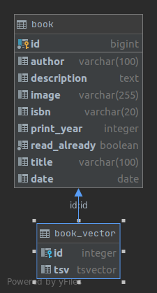

# Technaxis

## Table of Contents
- [Database Model](#database-model)

  
  
## Database Model


To increase the search speed create index 
and reduce the creation of vectors by adding a new field (tsv) and separate because you don't need to back up
 
Create index 
```postgresql

CREATE INDEX idx_gin_document
    ON book_vector
        USING gin ("tsv");
```
---

Adding occurs via a trigger
```postgresql
CREATE FUNCTION trg_tsv_trigger() RETURNS trigger AS
$$
BEGIN
    insert into book_vector (id, tsv) values (new.id, to_tsvector('english', COALESCE(NEW.description, '')));
    RETURN new;
END
$$ LANGUAGE plpgsql;
```
---

Example of how to get data with a keyword
```postgresql
EXPLAIN (ANALYSE )
SELECT book.id
FROM book
         INNER JOIN book_vector bv on book.id = bv.id
WHERE tsv @@ plainto_tsquery('rus');
```
